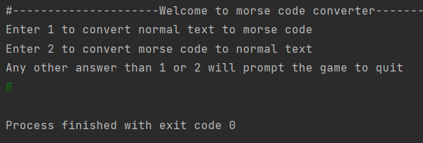
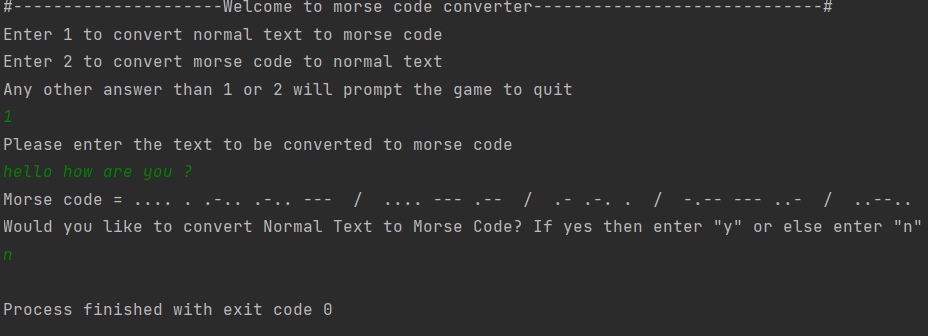
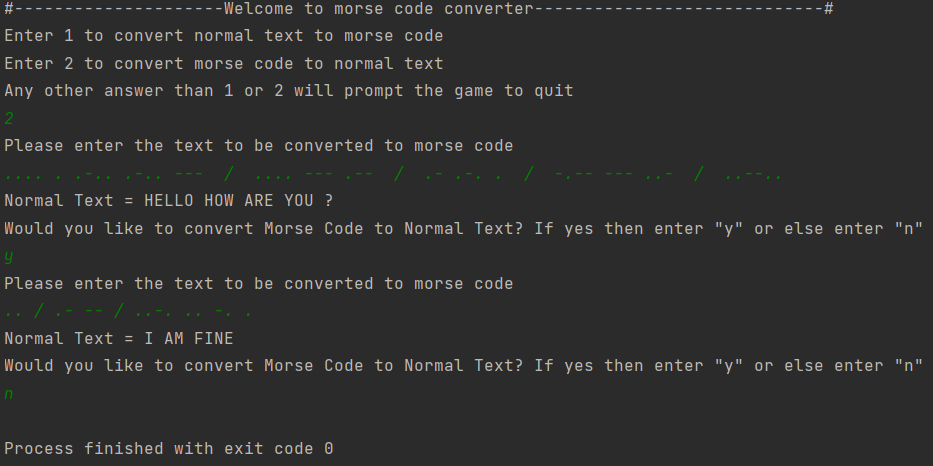

# Morse Code Converter

Convert text to Morse code or decode Morse code back to text.

## Overview

This Python application allows you to convert text to Morse code and vice versa. Morse code is a system of encoding text characters as sequences of two different signal durations, called dots and dashes. This application provides a simple and user-friendly way to work with Morse code.

## Features

- Convert text to Morse code.
- Decode Morse code back to text.
- Supports alphanumeric characters and common punctuation.

## Coding Language

- Python 3.x

## Example
The below image shows the working of the project

